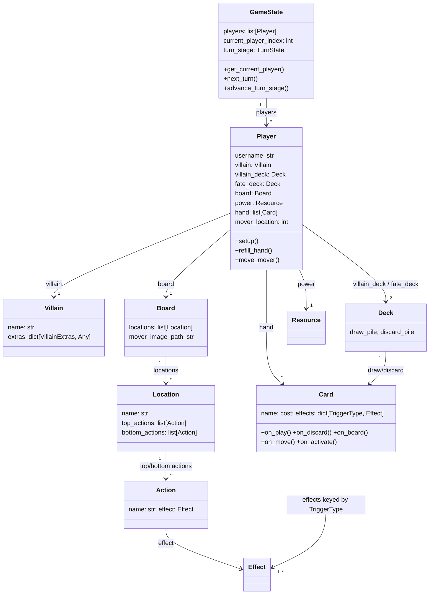
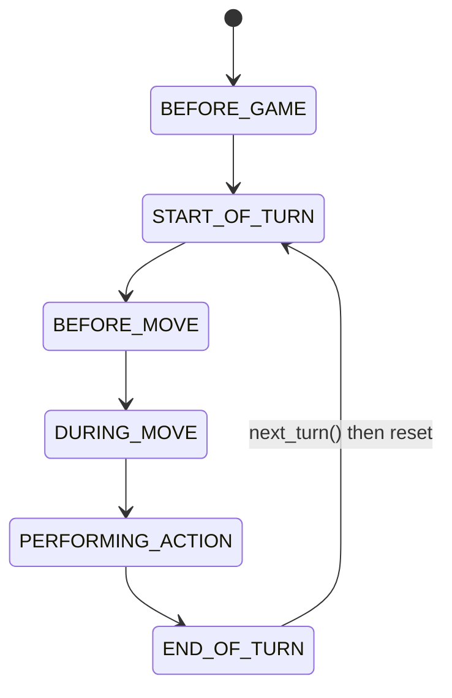

# Repository Overview: Villainous (Testing fork)

## 1. High-Level Architecture & Purpose

This repository is a Python re-implementation of Ravensburger's *Disney Villainous* board game, intended to support both single-player (AI) and local multiplayer play. At its current stage it is an **engine-first codebase**: the complete data model and turn/state machinery for the game has been scaffolded as a package of abstract classes and concrete helpers, while the only runnable entry point (`main.py`) is a bare Pygame window that does not yet wire into that engine. In other words, the game logic and the presentation layer exist side by side but are **not yet connected** — that integration is the obvious next milestone.

**Core tech stack**

- **Language:** Python 3.10+ (uses `list[X]` / `X | None` built-in generics and `from __future__ import annotations`).
- **UI / rendering:** Pygame (`pygame.init()`, `pygame.display.set_mode`, 60 FPS event loop).
- **Engine design:** Object-oriented with `abc.ABC` abstract base classes, `enum.Enum` state machines, and `typing.Final` constants.
- **No external engine dependencies** beyond Pygame. There is currently no `requirements.txt`, `pyproject.toml`, test suite, or packaging metadata.

## 2. Directory & File Map

```text
Testing/
├── .gitignore                     # Only ignores __pycache__ (note: no leading slash, no trailing slash)
├── README.md                      # One-line project description
├── business_logic_diagram.png     # Design diagram; the visual source of truth for the engine model
├── main.py                        # Pygame entry point (window + event loop); not yet engine-connected
└── engine/
    ├── __init__.py                # NOT PRESENT — engine works as an implicit namespace package
    ├── constants.py               # Final[str] villain + expansion names, HAND_SIZE rule
    ├── turn_state.py              # TurnState enum: the turn state machine
    ├── trigger_type.py*           # (under cards/) TriggerType enum: card event hooks
    ├── game_state.py              # Root aggregate: players, whose turn, advance_turn_stage()
    ├── game_object.py             # ABC for anything renderable (front/back image paths)
    ├── resource.py                # Generic counter (Power, Poison, Trust, …), clamped at 0
    ├── token.py                   # GameObject subclass for token art
    ├── villain.py                 # ABC: villain name + VillainExtras dict
    ├── villain_extras.py          # Enum classifying villain-specific extras (decks/resources/tokens/heroes)
    ├── deck.py                    # Draw + discard piles, auto-recycle, search, top/bottom insert
    ├── player.py                  # A seat: villain, both decks, board, power, hand, mover position
    ├── board.py                   # GameObject holding a list of Locations + mover art
    ├── location.py                # A board slot with top_actions / bottom_actions
    ├── action.py                  # Name + Effect pair (what a location lets you do)
    ├── effect.py                  # ABC-ish effect with execute(game_state); circular-import-safe
    └── cards/
        ├── card.py                # ABC: cost, art, effects map, trigger dispatch methods
        ├── trigger_type.py        # TriggerType enum (ON_PLAY, ON_DISCARD, ON_BOARD, ON_MOVE, ON_ACTIVATE)
        ├── combatant_card.py      # Card + strength; shared base for ally/hero
        ├── ally_card.py           # CombatantCard (villain-side minion)
        ├── hero_card.py           # CombatantCard (opponent-side/protagonist)
        ├── item_card.py           # Card + `attachable` flag
        ├── effect_card.py         # Card that resolves effects
        ├── condition_card.py      # Card gating win conditions
        └── custom_card.py         # Escape hatch for villain-specific behaviour
```

> `engine/cards/trigger_type.py` is listed in the tree above; the `engine/` root does not contain a `trigger_type.py`.

**Component purposes at a glance**

| Layer | Files | Responsibility |
|---|---|---|
| **Presentation** | `main.py` | Window, clock, event loop. Currently standalone. |
| **Orchestration** | `game_state.py` | Owns all players, current player index, and the turn-stage state machine. |
| **Player/seat state** | `player.py` | Per-villain realm state: decks, hand, power, board, mover position. |
| **Rules primitives** | `board.py`, `location.py`, `action.py`, `effect.py`, `resource.py`, `token.py` | Composable pieces that describe what a realm can do. |
| **Card model** | `cards/*` | Card taxonomy + event-driven trigger dispatch. |
| **Static data / config** | `constants.py`, `villain_extras.py`, `turn_state.py`, `trigger_type.py` | Enums and string constants that keep magic values out of logic. |

## 3. System Components & Interactions

### 3.1 Composition hierarchy

The engine is built as a containment tree. `GameState` is the root; everything else hangs off it:



Two deliberate design choices stand out:

1. **Mover position lives on `Player`, not `Board`.** `Board`'s own docstring states this explicitly — the board describes layout and art (shared/immutable-ish), while "where I currently am" is per-seat mutable state. This avoids boards needing to know who is standing on them.
2. **`Effect.execute(game_state)` is the universal mutation point.** Effects are the *only* place intended to mutate `GameState`. `effect.py` uses a `TYPE_CHECKING` guard to import `GameState` only for type hints, breaking what would otherwise be a `Effect → GameState → Player → Card → Effect` circular import.

### 3.2 Turn / execution flow

`GameState.advance_turn_stage()` implements a linear state machine defined by `TurnState`:



`DURING_CONDITION` (value `10`) is defined in the enum to represent a frozen turn while another player resolves a condition, but **no transition into or out of it exists yet** — the TODO in `game_state.py` marks it as unimplemented.

The intended per-turn data flow is:

1. **Setup (once):** for each `Player`, `setup()` shuffles `villain_deck` and `fate_deck`, resets `power` to the starting value, and calls `refill_hand()`.
2. **Start of turn:** villain condition cards are checked (`START_OF_TURN` is annotated "Checking conditions").
3. **Move:** `Player.move_mover(new_location)` validates the target index against `len(board.locations)` and rejects a no-op move. On success, `ON_MOVE` triggers could fire (currently stubbed).
4. **Perform action:** the player picks a `top_actions` or `bottom_actions` entry from their current `Location`; each `Action` carries one `Effect`, and `Effect.execute(game_state)` mutates state (spend power, play a card, vanquish, fate, etc.).
5. **End of turn:** `refill_hand()` tops the hand back to `HAND_SIZE` (4), drawing from `villain_deck`. `advance_turn_stage()` from `END_OF_TURN` calls `next_turn()`, wrapping `current_player_index` modulo the player count, and resets to `START_OF_TURN`.

### 3.3 Card event model

Cards are **data + triggers**, not subclasses with bespoke `play()` methods. `Card.__init__` takes a `dict[TriggerType, Effect]`; when the engine performs an action, `Card` exposes thin dispatchers (`on_play`, `on_discard`, `on_board`, `on_move`, `on_activate`) that look up the matching `Effect` and execute it. `TriggerType` enumerates only those five hooks. Because effects are passed in rather than hard-coded, the same `AllyCard`/`HeroCard` class can express completely different behaviour for every villain by varying the injected effects — which is what makes the `CustomCard` escape hatch rarely necessary.

**Known gap:** every dispatcher currently calls `self.effects[...].execute()` with **no arguments**, while `Effect.execute` requires a `game_state`. Each call site carries a `# TODO: Effect.execute needs the GameState` marker. This is the single most important consistency bug to fix before the engine can run.

### 3.4 Deck semantics

`Deck` stores the draw pile **bottom-first**: index `-1` (end of list) is the top, so `draw()` is a cheap `pop()`. Notably:

- `draw()` auto-calls `recycle_discard()` if the draw pile empties mid-draw, so a multi-card draw can safely mix recycled cards.
- `put_on_top` / `put_on_bottom` / `insert_card(position)` exist because several villains need precise deck manipulation (e.g. searching and stacking).
- `find()` searches the draw pile then the discard pile, but carries a TODO noting the *order* matters for some villains and needs verification.

## 4. Key Entry Points & Executables

| Item | Type | Role |
|---|---|---|
| `main.py` | **Executable entry point** | The only runnable script. Creates a 1280×800 Pygame window titled "Villainous", fills it with `BACKGROUND_COLOR` (30, 30, 30), runs a 60 FPS quit-event loop. Contains **no engine imports** — it is a blank canvas. |
| `engine/game_state.py` | **Engine entry point** | The class an app would instantiate first; owns players and drives the turn state machine. |
| `engine/constants.py` | Configuration | All villain names (as `Final[str]`) grouped by expansion, all expansion names, and `HAND_SIZE = 4`. The inline comment flags that `HAND_SIZE` may need to be per-villain (Jafar). |
| `engine/turn_state.py` | Configuration | `TurnState` enum defining legal phase values. |
| `engine/cards/trigger_type.py` | Configuration | `TriggerType` enum defining card event hooks. |
| `engine/villain_extras.py` | Configuration | `VillainExtras` enum keying villain-specific extras; docstrings enumerate which villains use which extra (e.g. Cruella's Puppy Tokens, Evil Queen's Poison). |

**Notably absent:** no `requirements.txt`, no `pyproject.toml`/`setup.py`, no `Dockerfile`, no `.env` template, no `Makefile`, no CI config, no tests directory, and no `__init__.py` files. The `engine` package works via Python's implicit namespace packages; adding `__init__.py` files would make packaging and tooling more robust.

## 5. Developer Cheat Sheet & Common Workflows

### Prerequisites

```powershell
python --version        # 3.10+ required for list[X] / X | None syntax
pip install pygame      # only third-party dependency
```

### Run

```powershell
python main.py
```

This opens the empty Pygame window. Expect no gameplay yet — there is no code path from `main.py` into `engine/`.

### Quick sanity check of the engine

Because there is no test suite, verify the engine imports and basic flow manually from the repo root:

```powershell
python -c "from engine.game_state import GameState; from engine.player import Player; from engine.deck import Deck; print('engine imports OK')"
```

A fuller smoke test requires constructing two `Deck`s, a `Board` (with `Location`s and `Action`s), and a concrete `Villain` subclass, then:

```python
from engine.game_state import GameState

gs = GameState(players)
for p in gs.players:
    p.setup(starting_power=0)

# Step the whole game forward one phase at a time
for _ in range(30):
    gs.advance_turn_stage()
    print(gs.turn_stage, gs.get_current_player().username)
```

### Common development tasks

| Task | How |
|---|---|
| Add a new villain | Create a `Villain` subclass (name + `extras` dict), define its `Board`/`Location`s/`Action`s, build its card objects with effect dicts, register its name in `constants.py`. |
| Add a new card type | Subclass `Card` in `engine/cards/`, add a constructor forwarding `effects: dict[TriggerType, Effect]` to `super()`, and (if needed) a new `TriggerType` member. |
| Implement an effect | Subclass `Effect`, override `execute(self, game_state)`, and put it in the relevant card's effects dict. |
| Change a game rule | Edit the `Final` constant in `constants.py` (avoid magic numbers in logic files). |
| Debug turn order | Call `GameState.advance_turn_stage()` step-by-step and print `turn_stage` + `get_current_player()`. |

### Known TODOs / technical debt (from in-code markers)

- **`Card` trigger dispatchers omit the `game_state` argument** on all five hook methods — blocks all card effects from executing (`cards/card.py`).
- **`DURING_CONDITION` state has no transitions** — condition resolution is unimplemented (`game_state.py`).
- **`advance_turn_stage()` silently `pass`es on unknown states** — needs logging (`game_state.py`).
- **Mover restrictions missing** for Maleficent and Syndrome (they may stay on their current location) — `move_mover()` only handles the standard "must move elsewhere" rule (`player.py`).
- **`Deck.find()` search order unverified** — order is significant for some villains (`deck.py`).
- **`Resource.spend_resource()`** silently ignores negative amounts and clamps at 0; needs logging (`resource.py`).
- **`Effect.execute()` base implementation is an empty `pass`** — abstract-by-convention rather than enforced by `@abstractmethod`.
- **`main.py` is not connected to the engine** and renders nothing.

---

*Generated by analyzing the repository at commit state on disk. If `business_logic_diagram.png` is the canonical design source, cross-check the diagram against `engine/` before large refactors — several engine TODOs suggest the diagram encodes more behaviour than the code currently implements.*
